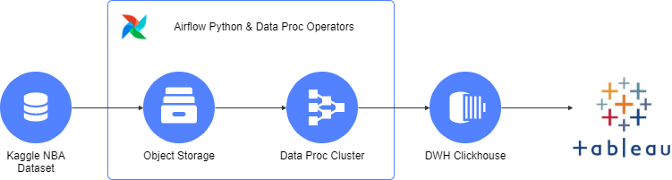
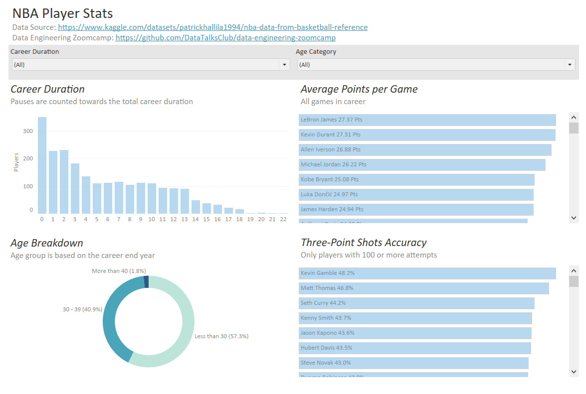

# Problem Description
The task is to analyze the NBA players & games data, which is stored in flat csv files at kaggle.com. Through the series of transformations and cleaning steps in PySpark, boxscore & players datasets are joined in a Clickhouse table.
All the steps are carried out by the means of Yandex Cloud services, except for Airflow orchestration and Tableau analysis.

The chosen metrics are the Three-Points Shots Accuracy, Average Points per game, Career Duration & Age Breakdown.

# Technologies
- Yandex Cloud (YC): Cloud-based platform by Yandex
  - Yandex Object Storage: s3 bucket data lake
  - Yandex Data Proc: Spark cluster for distributed data processing and transformations
  - Managed Service for Clickhouse: Cloud Hosted Data Warehouse Cluster
- Terraform: Infrastructure-as-Code (IaC)
- Docker: Containerization
- Airflow: Pipeline Orchestration

# Pipeline Description

Source data is stored at [kaggle](https://www.kaggle.com/datasets/patrickhallila1994/nba-data-from-basketball-reference), which is scraped from basketball-reference.com and contains NBA games & players data, which consist of 6 flat csv files.

Dataset is pulled by Airflow PythonOperator via Kaggle API and transformed from csv to parquet. Then files are pushed to the s3 bucket of Yandex Object Storage.

After ingest_to_bucket DAG is completed, ExternalTaskSensor starts transform_nba_data, which creates Data Proc cluster,
loads data from s3 bucket, processes parquet files in Spark and ingests the result to player_boxstats MergeTree table. It's partitioned by players team and ordered by PTS column.
The final results are analyzed with Tableau.

Object Storage buckets, service accounts, networks, Clickhouse cluster are created by terraform. Data Proc clusters are created and destroyed by a dockerized Airflow server.

# Dashboard
Dashboard consists of 4 charts: Players Distribution by Career Duration Bar Chart, Average Points per Game by Player Bar Chart, Three-Point Shots Accuracy by Player Bar Chart, Age Breakdown Donut Chart.
It is available at [Tableau Public](https://public.tableau.com/app/profile/sjanse/viz/ZoomcampNBAPlayerStats/NBAPlayerStats).

# Installation Process
- Install terraform.
- Install docker.
- Install yandex cloud cli.
- Register yandex cloud account.
- Register kaggle account.
- Download kaggle service account from the account settings page. Save it to ./credentials/kaggle/kaggle.json
- Create terraform service account with admin role.
- Download terraform service account json to credentials folder in project root.
- Add variables to terraform.tfvars file:
  - cloud_id;
  - folder_id;
  - clickhouse_username;
  - clickhouse_password;
  - sasl_username;
  - sasl_password;
  - rabbit_user;
  - rabbit_password.
- Run terraform plan within terraform folder.
- Run terraform apply within terraform folder.
- Run bash init_credentials.sh from root folder. It will create additional service accounts & credentials json.
- Run docker-compose build from docker folder.
- Run docker-compose up -d from docker folder.
- Open localhost:8080 in browser (airflow webserver page). Login: "airflow" & password: "airflow"
- Adjust start_date & schedule_interval parameters in dags.
- Unpause dags.
